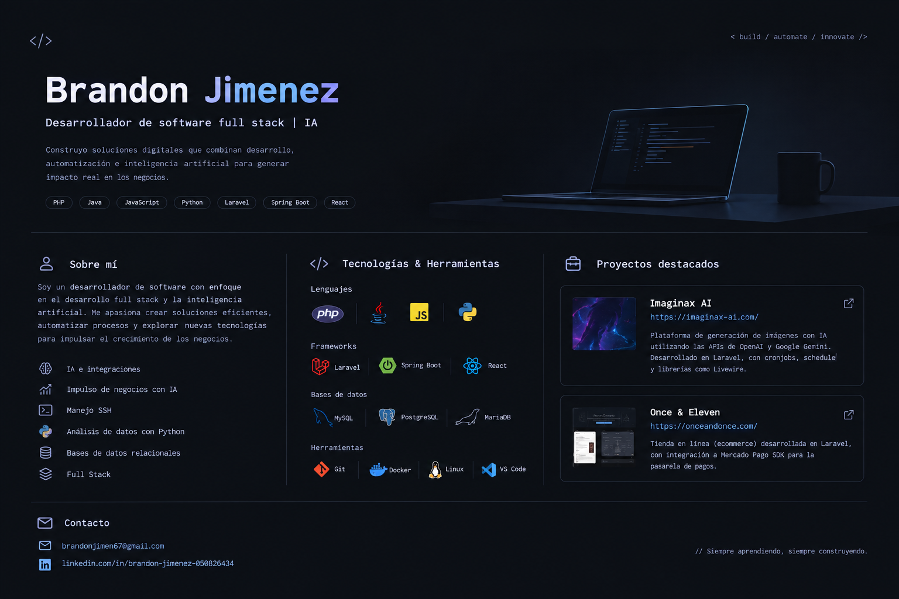

<div align="center">



</div>

# Brandon Jimenez

### Full Stack Software Developer | AI

I build web applications and digital solutions that combine **full-stack development, artificial intelligence and automation**.

My focus is on creating practical technology that can improve processes, connect services and help businesses take advantage of AI.

---

## 👨‍💻 About me

- 🚀 Full Stack Software Developer
- 🤖 Artificial Intelligence & AI integrations
- ⚙️ Business automation with AI
- 🐍 Data analysis with Python
- 🔐 Server and environment management with SSH
- 🗄️ Relational database management
- 🌐 Web application development

I enjoy working across the stack, from backend architecture and databases to frontend interfaces and third-party API integrations.

---

## 🧰 Tech Stack

### Languages

<p>
  
</p>

### Frameworks & Libraries

<p>
  
</p>

### Tools & Technologies

<p>
  
</p>

---

## 🤖 AI & Automation

One of my main areas of interest is integrating AI into real-world products and business processes.

### I work with

- Integration of AI APIs into web applications
- OpenAI and Google Gemini integrations
- AI-powered image generation
- Automated processes and scheduled jobs
- Cronjobs and application scheduling
- API integrations and third-party services
- Data analysis and processing with Python
- AI solutions focused on business growth

---

## 🚀 Featured Projects

### [Imaginax AI](https://imaginax-ai.com/)

AI image generation platform developed with **Laravel**, integrating image-generation APIs from **OpenAI** and **Google Gemini**.

**Highlights**

- Laravel backend
- OpenAI API integration
- Google Gemini API integration
- AI image generation
- Cronjobs and scheduled tasks
- Laravel Schedule
- Livewire
- Automation-oriented architecture

> A project focused on combining web development, AI and automation in a practical product.

---

### [Once & Once](https://onceandonce.com/)

E-commerce platform developed with **Laravel**, including online payment integration through the **Mercado Pago SDK**.

**Highlights**

- Laravel
- E-commerce architecture
- Mercado Pago SDK
- Payment gateway integration
- Backend and frontend development
- Relational data management

> A full-stack commerce project focused on building a functional online purchasing experience.

---

## 🧠 What I Like Building

```text
AI-powered applications
        ↓
Business automation
        ↓
API integrations
        ↓
Full-stack web applications
        ↓
Data & relational databases
```

I am especially interested in projects where software development and AI can be combined to solve concrete business problems.

---

## 📈 Development Focus

| Area | Focus |
|---|---|
| Full Stack | Backend + Frontend + APIs |
| Artificial Intelligence | AI APIs, image generation & integrations |
| Automation | Cronjobs, schedules & automated workflows |
| Data | Python analysis & relational databases |
| Infrastructure | Linux & SSH |
| Web | Laravel, Spring Boot & React |

---

## 📫 Contact

<p>
  <a href="mailto:brandonjimen67@gmail.com">
    
  </a>
  <a href="https://www.linkedin.com/in/brandon-jimenez-050826434/">
    
  </a>
</p>

---

<div align="center">

### `// Siempre aprendiendo, siempre construyendo.`

</div>


